# FDI (For Direct Indexing)

다이렉트 인덱싱을 어시스트하는 LLM 기반 주식 종목 추천 서비스입니다.
NaverClova의 LLM 서비스를 이용하여 종목을 추천합니다.

> **다이렉트 인덱싱(Direct Indexing)이란?**
>
> 투자자가 자신의 투자 성향에 따라 포트폴리오를 자유롭게 구성하여 원하는 지수를 만들 수 있는 상품

## 구성원
<table>
    <tr>
        <td></td>
        <td></td>
        <td></td>
    </tr>
    <tr align=center>
        <td><a href='https://github.com/Leehyeonju0219'>이현주</a></td>
        <td><a href='https://github.com/kyeongseo90'>최경서</a></td>
        <td><a href='https://github.com/yoonjaeuk'>윤재욱</a></td>
    </tr>
</table>

## 기획 배경

다이렉트 인덱싱(Direct Indexing)은 투자자가 S&P 500 과 같은 특정 지수의 구성 종목을 직접 개별적으로 보유함으로써 해당 지수를 추종하는 투자 전략이다. 이는 전통적인 상장지수펀드(ETF)나 인덱스 펀드와는 달리, 투자자가 개별 종목을 직접 매입하고 관리하기 때문에 맞춤형 포트폴리오를 구축할 수 있다는 큰 장점이 있다.

다이렉트 인덱싱 시장은 기술 발전과 데이터 분석 기법의 발전으로 인해 급격히 성장하고 있다. 2000 년대 초반에 시작된 다이렉트 인덱싱은 최근 몇 년간 로보 어드바이저와 핀테크 기업의 등장으로 더욱 주목받고 있다. 특히, 맞춤형 투자에 대한 수요 증가와 함께 개인화된 포트폴리오 관리의 관심이 확대되면서 다이렉트 인덱싱이 인기를 끌고 있다.

2020 년 기준으로 다이렉트 인덱싱 자산은 3,500 억 달러를 넘었으며, 2026 년까지 8,000 억 달러 이상으로 증가할 것으로 예상된다. 미국 금융 리서치 세룰리어소시에이츠(Cerulli Associates)에 따르면, 이는 ETF, 뮤추얼 펀드, SMA(Separately Managed Account)보다 월등히 더 빠른 성장률을 보일 것으로 전망된다.

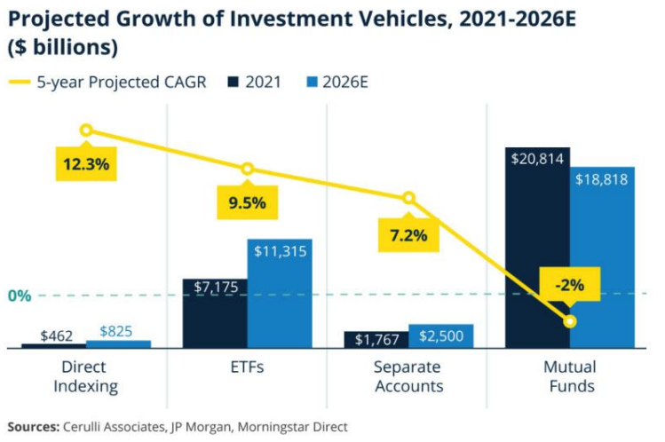

## 주제 설명
### 주요 기능

1. LLM 기반 사용자 니즈 파악 대화형 에이전트

2. 사용자 맞춤형 종목 순위 제공 기능

3. 종목 상세 정보 제공 기능
    3.1. 실시간 시세 및 대중의 감정 지수 제공
    3.2. 종목 언급량 추이 시각화 그래프
    3.3. 최신 뉴스 및 관련 키워드 제공
    3.4. 재무제표를 활용한 투자 지표 제공

4. 백테스트 기능

### 기대효과

1. 쉽게 접근할 수 있는 다이렉트 인덱싱
2. 개인화된 투자 지원
3. 시각적 분석 도구 제공
4. 보다 정확하고 신뢰할 수 있는 투자 결정을 통한 고객 만족도 향상

### 확장 가능성

1. 해외 주식 기업 분석
2. 다양한 가중치 지수 도입

## 데이터 및 알고리즘

1. 한국투자증권 Dart 재무제표
2. 감정지수
3. 언급량
4. 6가지 가중치 지수: 수익성, 성장성, 안전성, 활동성(재무지표), 언급량, 감성지수(재무상태 외 지표)
5. 언어모델 : LLM 학습을 위한 180개의 대화 데이터(900 row)
6. 클러스터링 (머신러닝-비지도학습) : 데이터의 자연스러운 군집구조를 발견하기 위하여 종목 간 유사성을 파악하고자 함

## 서비스 플로우차트

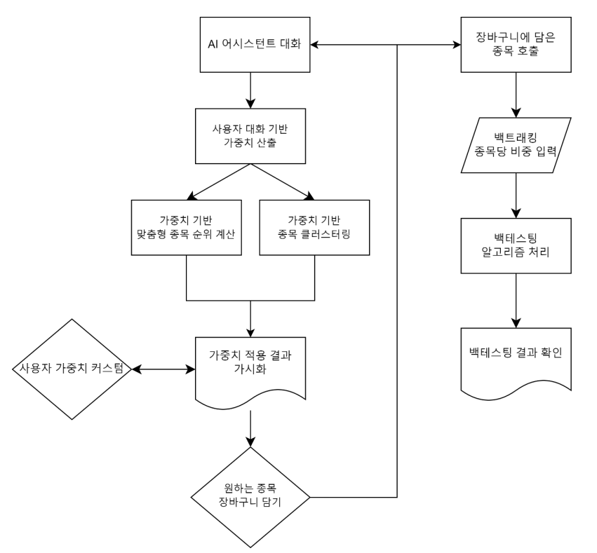

## 화면 설명

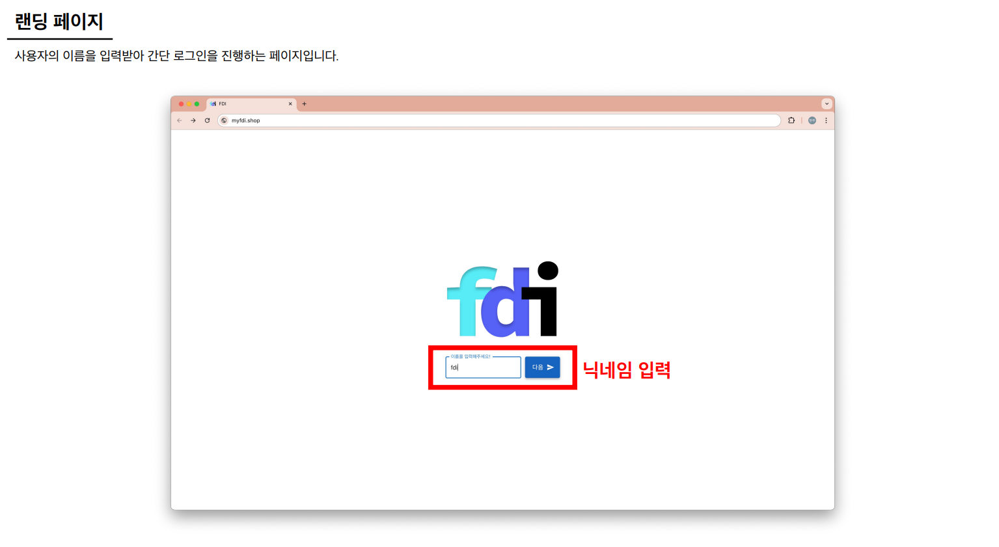
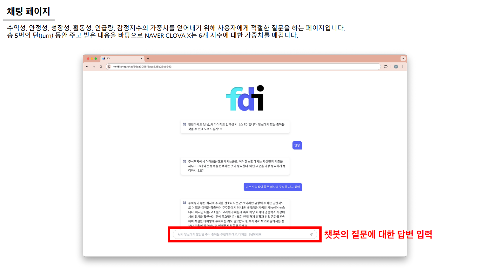
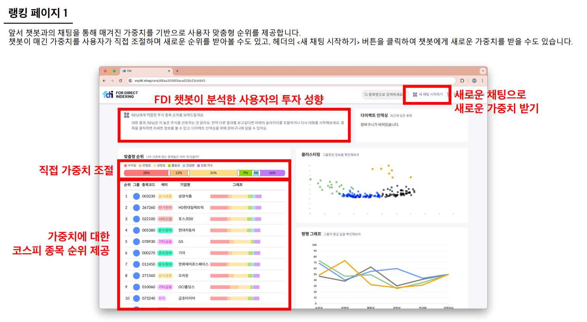
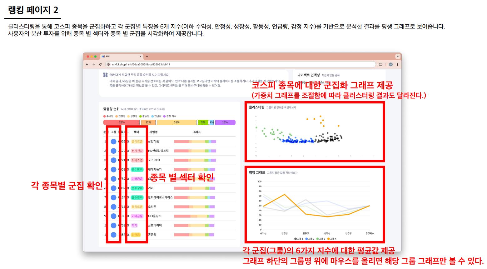
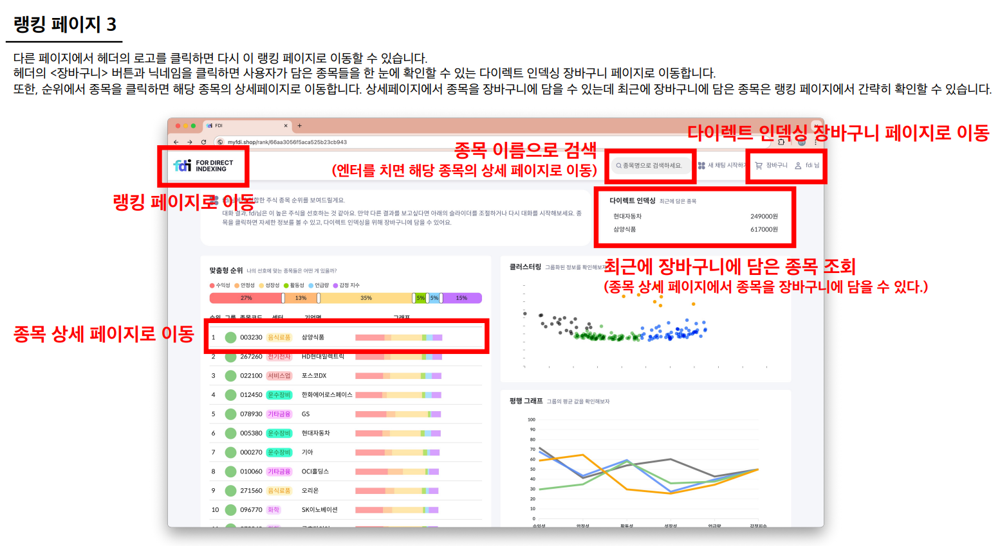
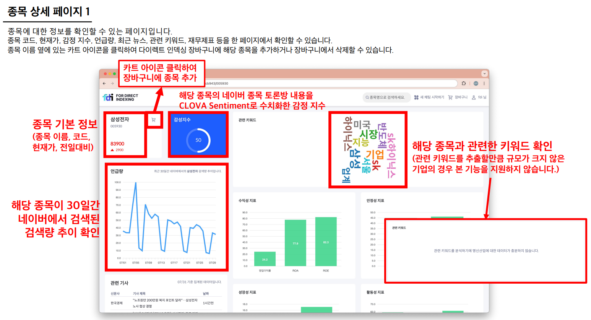
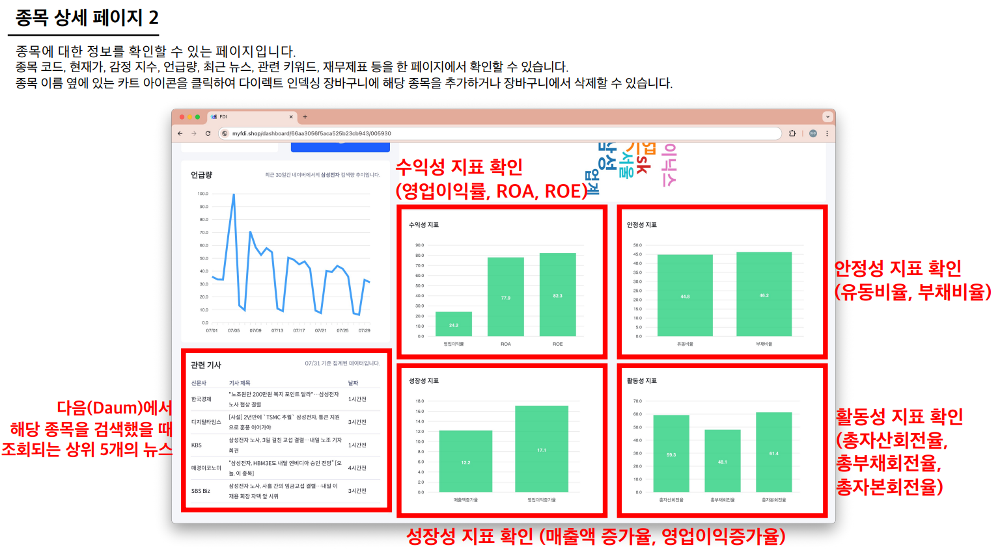
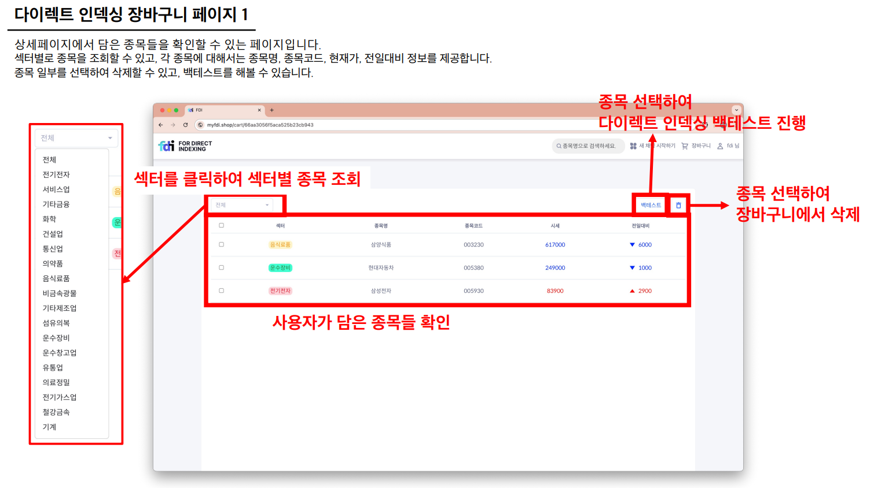
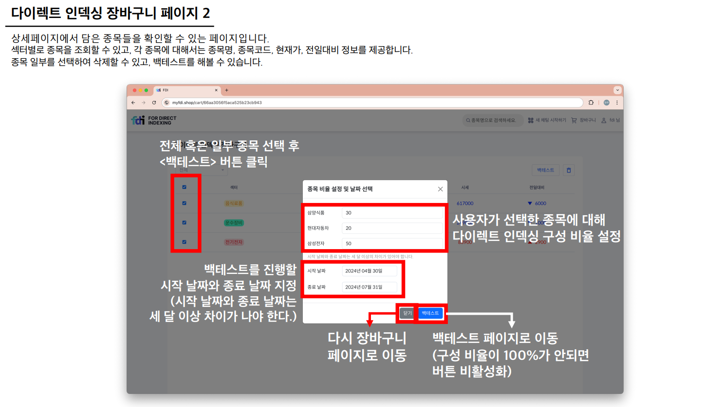
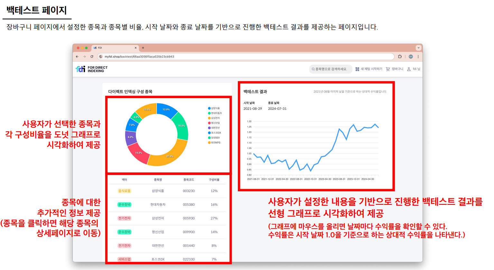